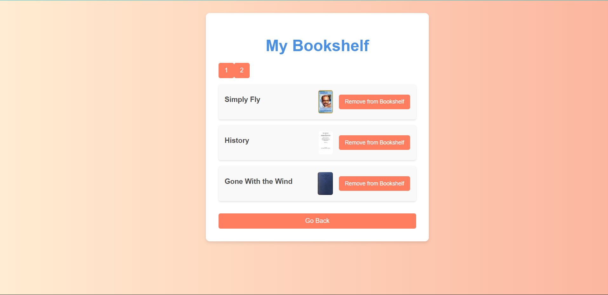

# Personal BookShelf Application
## How to Set Up the Project Locally
### Installation

1.Clone the Repository

Clone the repository to your local machine using the following command:

git clone https://github.com/rsrirsri66/MyBookSelf.git

2.Navigate to the Project Directory

Change your working directory to the project directory:

cd book-search

3.Install Dependencies

Install the project dependencies using npm:

npm install

## Steps to Run the Application on a Local Machine

1.Start the Development Server

Start the development server using npm:

npm start

2.Access the Application

Once the development server is running, you should see the Book Search application in your browser. You
can now search for books, add them to your bookshelf, and navigate to the bookshelf page.

## Additional Information
React Router: This application uses React Router for navigation. The navigate function from react-router-
dom is used to navigate to the bookshelf page.(Install react-router-dom)

Open Library API: The application fetches book data from the Open Library API.

Local Storage: The bookshelf is stored in the browser's local storage.

## Screenshot

 

Happy Coding! : )

